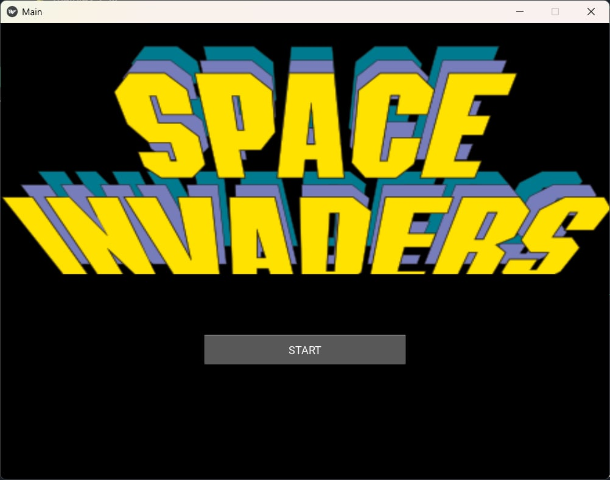
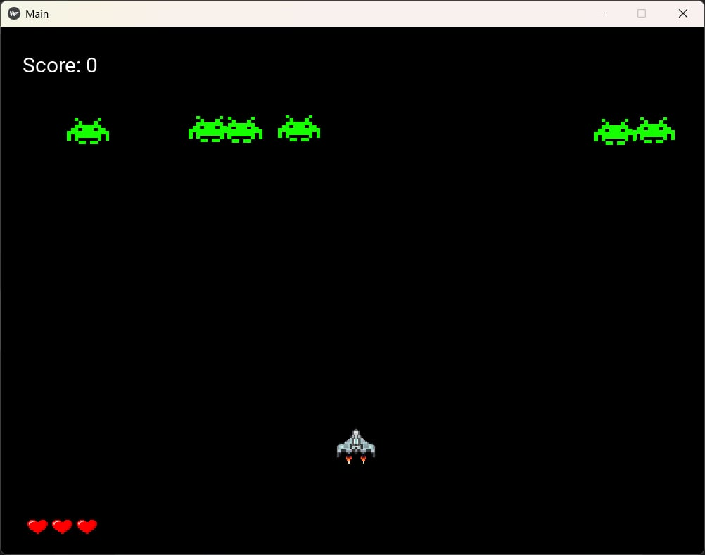

# 👾 Space Invaders Game

This is a simple 2D space shooting game built with **Python** and **Kivy**. The player controls a spaceship and must shoot down waves of aliens before they reach the bottom of the screen. The project was developed as a group assignment and serves as an introduction to game development using Python GUI frameworks.

---

## 🎓 Developers

- **Phoorin Nickphong** (6510110371)
- **Thanaphum Bubaso** (6510110194)
- **Ilham Hajidoloh** (6510110575)

---

## 🧰 Technologies Used

- **Python 3**
- **Kivy** (for GUI and game interaction)
- `.kv` layout files
- Images and sound assets for game effects

---

## 📁 Project Structure

```
Space-invaders-game/
├── images/           # Sprite assets
├── sounds/           # Sound effects
├── main.py           # Main Python script
├── main.kv           # Kivy layout definition
└── README.md
```

---

## 🎮 How to Play

- Move the spaceship **left and right**
- Press the fire button to **shoot lasers**
- Destroy all enemies before they reach the bottom of the screen

---

## ▶️ Getting Started

### 1. Install dependencies

Make sure Python and pip are installed, then run:

```bash
pip install kivy
```

### 2. Run the game

```bash
python main.py
```

---

## 🖼️ Screenshots

<p align="center">
  
</p>

<p align="center">
  
</p>

---

## 📌 Notes

- Developed as a team project in a beginner-level game development course
- Focused on applying Python logic with Kivy GUI elements
- Structured for modular expansion (e.g., levels, power-ups, scores)

